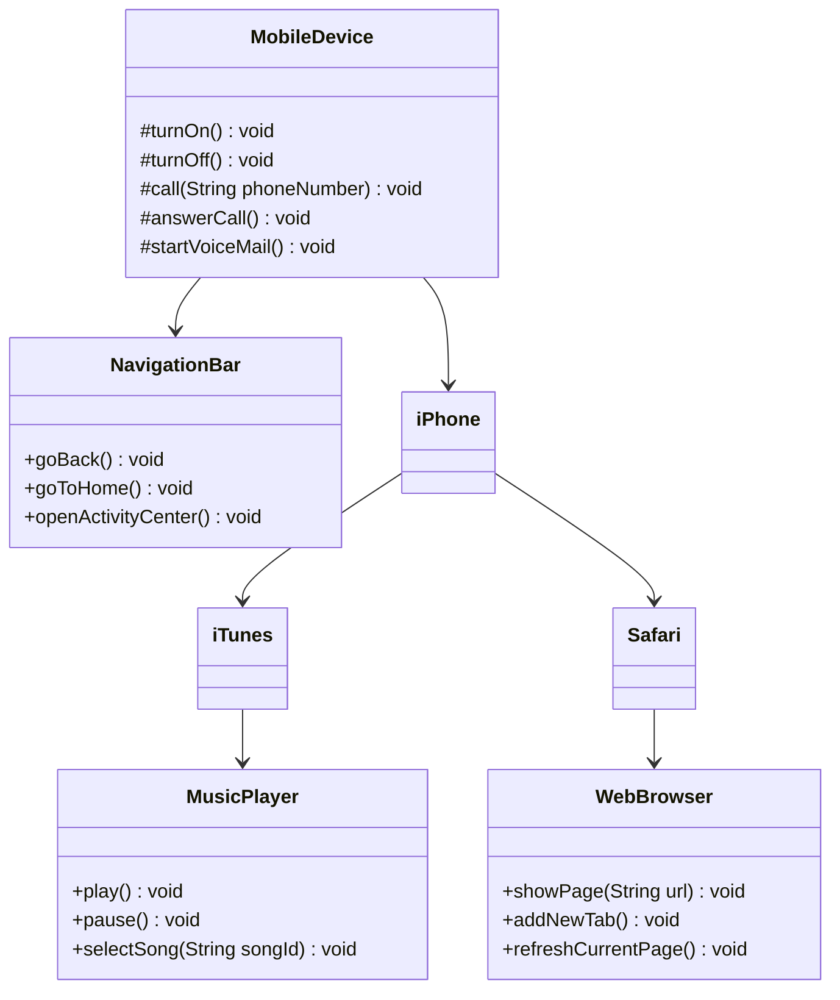

# Projeto: Programação Orientada a Objetos (POO/OOP)

## 📚 Sobre
Este projeto inclui um exemplo de como a programação orientada a objetos (POO) pode ser implementada em Java.  

## 📋 Diagrama de Classes

